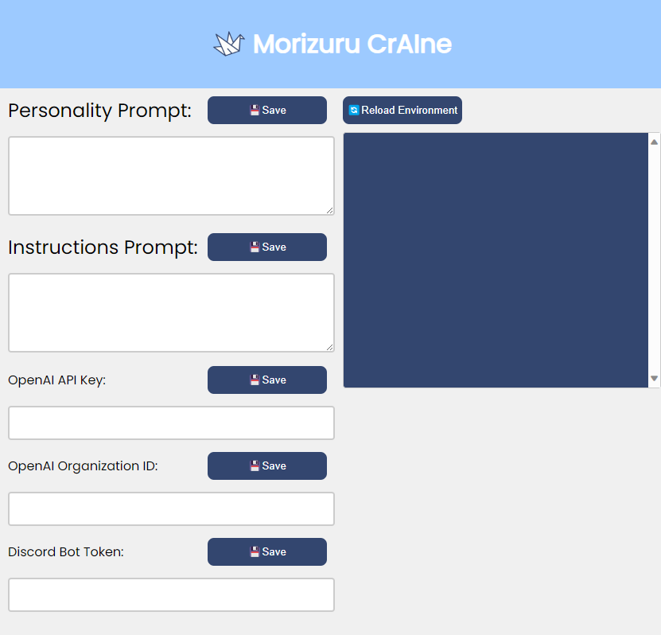

# Discord-Interpreter
A Discord bot that leverages open interpreter to answer queries and modify files with a web configuration gui.  Actively in development! Pull requests are welcome.

Web Configuration GUI:



## Setup

1. Clone the repository:

```bash
git clone https://github.com/Maclean-D/Discord-Interpreter.git
```

2. Install the required dependencies:

```bash
cd Discord-Interpreter
```

1. Run the bot:

```bash
node server.js
```

4. Configuration:

## Usage

To use the bot, 

#### Other

Purchases made through some links may provide some compensation to Maclean Dunkin.