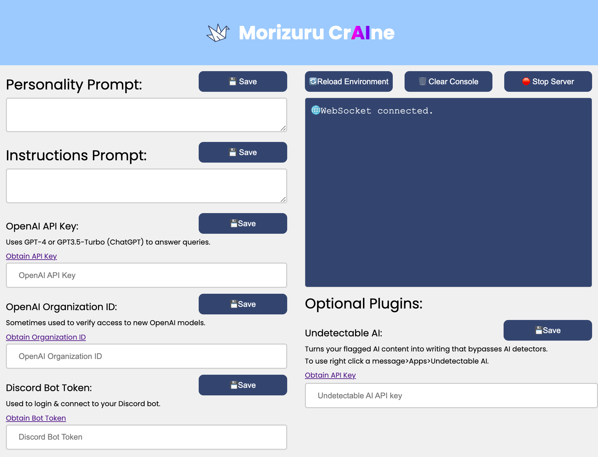

# Discord-Interpreter
A Discord bot that leverages [open interpreter](https://github.com/KillianLucas/open-interpreter) and other plugins to answer queries and modify files, with a snazzy web configuration gui. Actively in development, Pull requests are welcome!

Web Configuration GUI:


## Features & Usage

## Roadmap

- [x] Web configuration gui
- [ ] Connect to Discord
  - [ ] Set Status
  - [ ] Create App Context Menus
  - [ ] Create Slash Commands
- [ ] Open-Interpreter Support
- [ ] Undetectable AI Support

## Setup

1. Clone the repository:

```bash
git clone https://github.com/Maclean-D/Discord-Interpreter.git
```

2. Install the required dependencies:

[Install the latest LTS version of Nodejs](https://nodejs.org/en/download)
```bash
cd Discord-Interpreter
npm install express
npm install body-parser
npm install dotenv
npm install ws
npm install discord.js
```

3. Run the bot:

```bash
node server.js
```
or open the `WindowsStart.bat` file if you are on Windows.

4. Configuration:

Open the localhost url by `Ctrl+clicking` on the localhost url provided by the terminal or by typing `localhost:3000` into your browser. Everything on the left half needs to be filled out for your bot to work.

#### Other

Purchases made through links may provide some compensation to Maclean Dunkin.